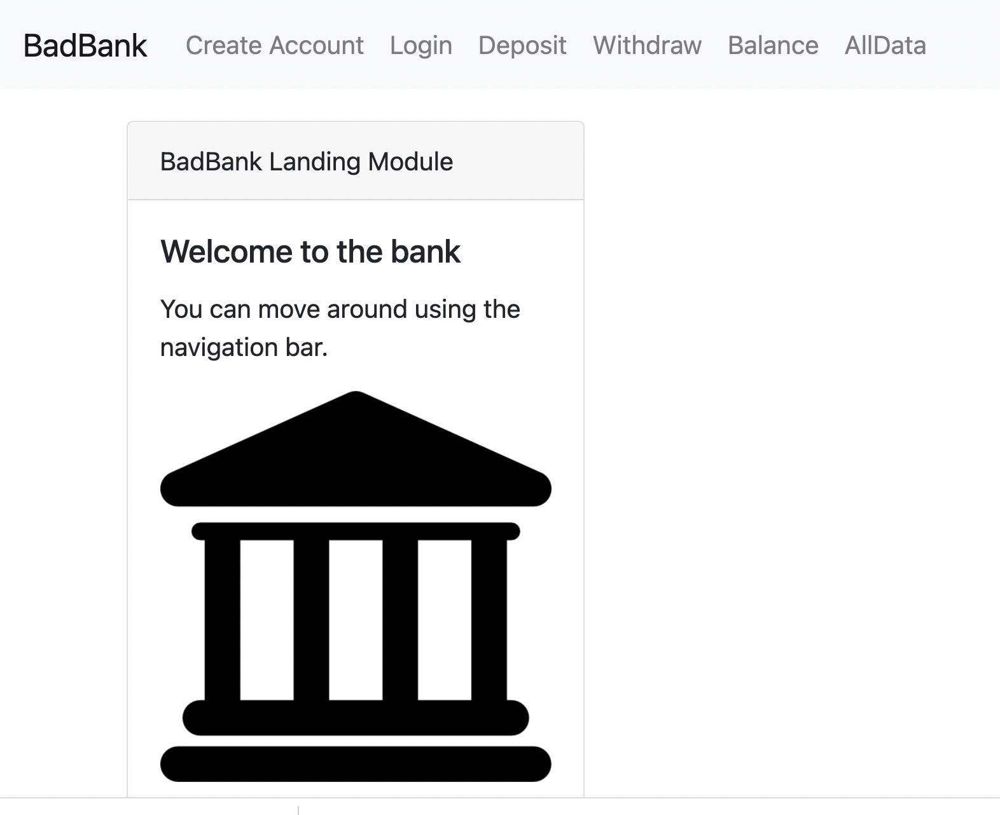

# Banking app

## Description:
banking app simulator with user authentication and connected front and back ends

## Installation: 
under construction

## 

## Technology: 
Mongo, Express, React, Node 

## Features: 
Nav bar, account creation, user authentication and authorization, deposit/withdrawl functionality and database storage.

## License: 
MIT
